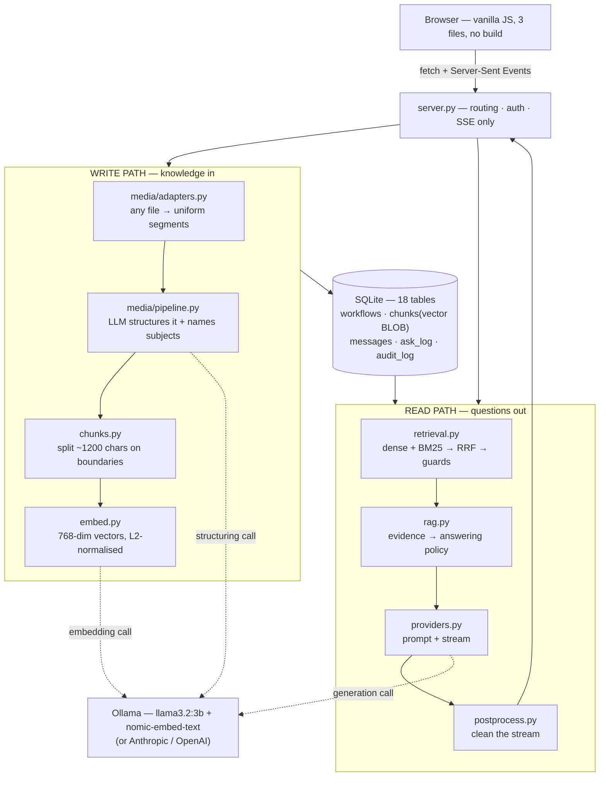
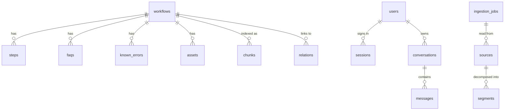
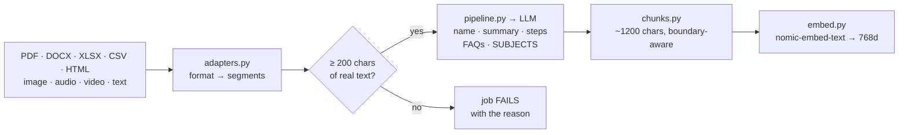
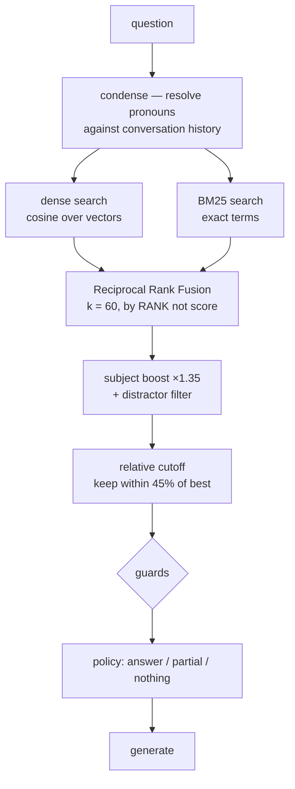

# Spacebot — system architecture

How the whole thing works, front to back: what happens to a file when someone uploads it,
what happens to a question when someone asks it, and why each piece is built the way it is.

For the retrieval layer in depth — the measured numbers behind every threshold — see
[ARCHITECTURE-RAG.md](ARCHITECTURE-RAG.md). This document is the system around it.

---

## What it is

An internal knowledge assistant that runs entirely on the customer's own hardware. Point it
at what a team has already written — runbooks, policies, spreadsheets, CVs, transcripts —
and people ask questions in plain language. They get grounded answers with sources, or an
honest "we don't have that" which becomes a task for whoever does.

**~6,150 lines of Python.** Standard library and SQLite for everything structural. The only
third-party packages parse files or do arithmetic: `numpy`, `pypdf`, `python-docx`,
`openpyxl`, `beautifulsoup4`, `pillow`.

No framework, no Docker, no Postgres, no npm, no build step. That is a product decision, not
a preference: "runs on your premises" has to mean *one folder and one file*, or the customer
has a stack to operate before they have an assistant.

---

## The shape



Two paths, one store. Everything else is detail.

---

## 1. Front end — `sb/web/`

| File | Job |
|---|---|
| `index.html` | shell — sidebar, view container |
| `app.js` | all three views, event delegation, SSE client |
| `app.css` | design system, light + dark |
| `markdown.js` | minimal renderer (no dependency) |
| `icons.js` | inline SVG set |

One render function per view (`chatView`, `studioView`, `adminView`), a single delegated
click handler, and `state` as a plain object. No framework, because a build step is a thing
the customer would have to run.

**Answers stream over SSE**, not a JSON response. A local 3B model on CPU takes 30–60
seconds to finish; the user sees words in about two. Event sequence:

```
conversation  → id + provisional title (the question, truncated)
status        → "Reading Yaswanth — CV…"       (what we're reading, never how retrieval went)
grounding     → success-check lines to mark
delta × N     → answer tokens
meta          → sources, confidence band, follow-up chips
title         → the model's name for this conversation
done
```

`title` arrives **after** the answer deliberately. Naming a conversation up front would put a
second model call between pressing Enter and the first token. Doing it afterwards costs
nothing and produces a better title, because it has seen the answer.

---

## 2. HTTP layer — `server.py` (731 lines)

Owns HTTP concerns only: routing, auth, serialisation, SSE framing. Retrieval goes to
`sb.rag`, model choice to `sb.providers`, storage to `sb.db`, UI to `sb/web/`.

A route is one decorator; `@needs` is the **only** place a role is ever checked:

```python
@route("POST", r"/api/workflows/(?P<key>[^/]+)/delete")
@needs("author")
def api_workflow_delete(h, key): ...
```

### Roles

| Role | Can |
|---|---|
| `user` | chat, own conversations |
| `author` | + Knowledge Studio: ingest, publish, view/edit/delete entries, see gaps |
| `admin` | + audit Overview, model settings |

### Routes

| | |
|---|---|
| **Pages** | `/`, `/login`, `/logout`, `/static/<file>`, `/blob/<key>` |
| **Auth** | `POST /api/login`, `GET /api/me` |
| **Chat** | `GET|POST /api/conversations`, `GET|rename|delete /api/conversations/<id>`, `POST /api/ask`, `POST /api/ask/stream` |
| **Knowledge** (author) | `GET /api/catalog`, `POST /api/ingest`, `GET /api/jobs/<id>`, `GET/update/delete /api/workflows/<key>`, `POST /api/workflows/<key>/publish`, `GET /api/gaps`, index status/rebuild |
| **Admin** | `GET /api/admin/overview`, `GET|POST /api/settings`, `GET /api/model/health` |

### Two subtleties worth keeping

**Bodies are always drained.** Handlers that take arguments from the URL never read the
request body, so on a keep-alive connection the next request parsed as `{}POST /api/…` and
the stdlib rejected it — every second POST from the browser returned 501. `_drain()` in the
dispatch `finally` consumes whatever the handler ignored.

**Nothing may raise once a stream has begun.** Past `begin_sse()` the generic error handler
would try to send a second set of headers into a live response.

---

## 3. Storage — SQLite, 18 tables



| Group | Tables | Holds |
|---|---|---|
| Knowledge | `workflows` `steps` `faqs` `known_errors` `assets` `relations` | the authored/ingested entry and its parts |
| Retrieval | `chunks` | text + a 768-float vector BLOB + `subjects` |
| Chat | `conversations` `messages` | history, and the `meta` behind each answer |
| Ingestion | `ingestion_jobs` `sources` `segments` | the audit trail of how a file became an entry |
| Audit | `ask_log` `audit_log` `gaps` | who asked what, who changed what, what we couldn't answer |
| Config | `settings` `users` | provider keys, org identity, accounts |

**Vectors live in the same file as everything else.** A float32 BLOB per chunk, stacked into
one numpy matrix and scanned with a single dot product. Exact, no index to build, no service
to run — good to ~100k chunks. `chunks.search_dense()` is the only function that changes
when you outgrow that.

**Migrations run lazily on first connect** (`db.connect()`), not only in `init_db()`. A
column added after release must not depend on someone remembering to initialise — that is
exactly what an existing deployment fails to do after pulling new code.

---

## 4. Write path — how a document becomes answerable



**Adapters raise; they never return placeholder text.** A missing `pypdf` once returned
`"[PDF parsing needs pypdf]"` as document content, and the structurer invented an entire
published workflow from that sentence. Unreadable input now fails the job and says why.

**A 200-character floor.** Below that we refuse rather than let a model fill the gap.

**Subjects are extracted here** — who or what the document is *about*, named by the model
that read it. Portable (any language, no tuning) and the single most valuable field for
preventing wrong answers. `sb/subjects.py` keeps a statistical extractor as a fallback for
material ingested before this existed.

Subjects **accumulate** across re-ingests rather than replacing, because a model asked the
same question twice does not answer the same way twice — one forgetful run must not delete
an attribution an earlier run got right.

Ingestion is a **background job** with a polled status (`/api/jobs/<id>`). Structuring a
document on a 3B CPU model takes 200–250 seconds.

---

## 5. Read path — what happens to a question



**Condense** rewrites a follow-up into a standalone question. Both the rewrite *and* the
user's literal words are searched — a rewrite once dropped a person's name and the answer
came back about a vendor.

**Hybrid search**, because each leg covers the other's blind spot:

| | Good at | Blind to |
|---|---|---|
| Dense | paraphrase — "undo a release" finds the rollback runbook | rare literals |
| BM25 | `ERR_LEASE_HELD`, `spacectl`, a person's name | any rephrasing |

Fused by **RRF**: combines by *rank*, because a cosine and a BM25 score are not on comparable
scales and normalising them is a fudge that needs retuning whenever the corpus changes.

**Cross-workflow by construction.** Chunks rank globally, then group by document, then the
relation graph is walked one hop. An answer combining a spreadsheet row with a Word policy is
the normal path, not a special case.

### The guards

Each exists because of a real wrong answer. All four end the same way — the context is
**removed** and the answer becomes "we don't have this".

| Guard | Catches | The answer that caused it |
|---|---|---|
| `unsupported_terms` | nothing asked appears in what we found | — |
| `unknown_subjects` | a person/company the corpus never mentions | *"any info about Sreedhar Masula?"* → answered from Yaswanth's CV |
| `subject_miss` + distractor filter | material about a **different** person | *"what is Priya's current role"* → "Full Stack Engineer" (Yaswanth's) |
| `attribute_gap` | right person, wrong fact | *"what languages does Arjun know"* → "Python and Java", invented |
| `thin_match` | every word in the corpus, scattered across unrelated documents | *"how to read github secrets"* → VPN + AWS steps at 0.549 |

Removing the context beats instructing the model to ignore it. Given a page of CV facts and
told not to use them, a 3B either recites them or invents a negative.

---

## 6. The model call — `sb/providers.py`

One interface over Ollama / Anthropic / OpenAI / an offline heuristic. Swapping to a hosted
model is one setting on the admin page.

Context reaches the model grouped by document, **best evidence first** (models weight the top
of the window heavily), each group labelled:

```
### Yaswanth — CV  [PEOPLE.YASWANTH_CV]
These excerpts are about: Yaswanth, Kamineni
[faq-1] …
```

Then a **policy**, chosen in code from the evidence score — never by the model:

| Evidence | Policy | Behaviour |
|---|---|---|
| ≥ 0.40 | `answer` | answer fully |
| 0.15 – 0.40 | `partial` | answer what's there, name the gap |
| < 0.15, or any guard | `nothing` | say so warmly, offer the nearest topic |

**Answer shape is decided in code too.** A 3B handed three shape options picks wrong often
enough to matter, so `rag._shape()` decides prose vs numbered steps and passes an exact step
count.

### Two prompt rules learned the hard way

1. **No concrete examples.** Three times a worked example became the output verbatim —
   including a partial-answer example that produced *"I've got his experience and education"*
   for a woman. Everything uses `<angle bracket>` placeholders.
2. **No customer names.** Prompts carry `%%ORG%%` / `%%BOT%%`, filled from settings, so a
   fresh clone never introduces itself as somebody else's assistant.

---

## 7. Coming back

`postprocess.py` strips model tics — a bolted-on title line, internal IDs
(`PROC.VENDOR_APPROVAL` → "the vendor approval process").

The `meta` event carries sources, confidence band, verification lines and follow-up chips.

`ask_log` records the question, who asked, and which documents answered — which is where the
admin's "most used knowledge" comes from, with no extra instrumentation.

---

## 8. Audit — `audit_log` + `ask_log`

The admin Overview answers four questions on one screen:

- **What are people asking**, and did we have an answer (`ask_log`)
- **Which knowledge is load-bearing** — usage counts per document
- **What is published but never used** — live knowledge nobody has needed
- **Who changed what** — ingested / published / edited / deleted, with actor and time

Deliberately **no read logging**. Every retrieval is already recoverable from `ask_log`, and
logging reads would bury "who last touched this" — the question an admin actually has when an
answer turns out wrong — under noise.

Audit writes **swallow their own errors**: a failure to record history must never fail a
publish.

---

## 9. Tuning constants — `sb/config.py`

Every threshold lives here, measured on a real corpus rather than guessed. The reasoning for
each is in the file and in [ARCHITECTURE-RAG.md](ARCHITECTURE-RAG.md).

| Constant | Value | Why |
|---|---|---|
| `CHUNK_CHARS` / `CHUNK_OVERLAP` | 1200 / 180 | keeps a step or CV section whole in one chunk |
| `RETRIEVE_CANDIDATES` / `RETRIEVE_CHUNKS` | 40 / 10 | per retriever before fusion / handed to the model |
| `RRF_K` | 60 | standard damping |
| `RELATIVE_CUTOFF` | 0.45 | fixed top-K padded focused questions with unrelated documents |
| `SUBJECT_BOOST` | 0.35 | promotes the right person; ordering only, never admission |
| `MIN_QUERY_COVERAGE` | 0.30 | measured gap: answerable 0.33–1.00, not 0.00–0.25 |
| `EVIDENCE_STRONG` / `EVIDENCE_WEAK` | 0.40 / 0.15 | answerable probes ≥ 0.53, unanswerable ≤ 0.08 |
| `EMBED_MODEL` | `nomic-embed-text` | Apache-2.0, 768-dim, ~270MB, CPU-friendly |

---

## 10. Running it

```bash
bash tools/status.sh     # what's running, is Ollama up, where's the DB
bash restart.sh          # restart server (and Ollama if needed)
bash runall.sh           # all 15 test suites
```

First run on a clean machine:

```bash
ollama serve & ; ollama pull llama3.2:3b ; ollama pull nomic-embed-text
pip install --user pypdf python-docx openpyxl beautifulsoup4 lxml numpy pillow

python3 setup.py --org "Your Company" --admin you@example.com   # real install
#   or: python3 seed.py                                         # demo data + demo logins

python3 ingest.py ./your-documents --publish
python3 server.py
```

Useful tools:

| Command | Does |
|---|---|
| `tools/reset_activity.py --yes` | clear usage + audit history (test runs pollute it) |
| `tools/demo_traffic.py` | ask realistic questions so the Overview has data |
| `backfill_subjects.py` | name subjects for documents ingested before that existed |
| `tools/repair_test_damage.py` | undo metadata a test run wrote over real entries |

---

## 11. Testing

15 suites, `bash runall.sh`. Cheap ones first — a failure there usually explains the slow ones.

| Suite | Protects |
|---|---|
| `test_portable` | no shipped prompt names the first customer |
| `test_subjects` / `_nonvacuous` / `_persistence` | subject attribution, and that its guards actually fire |
| `test_roles_audit` | who can do what — **the negative cases matter most** |
| `test_titles` | auto-naming, and that a human title is never overwritten |
| `test_thin_match` · `test_sreedhar` · `test_cross_person` · `test_abstain` | each a real wrong answer that must not return |
| `test_conflation` · `test_availability` | subject confusion across a conversation |
| `test_ingest_guard` · `test_formats` · `test_no_leak` | unreadable input fails; formats work; nothing leaks between corpora |
| `test_fresh_install` | a stranger can clone this and use it |

Two habits baked into these:

- **Every guard has a non-vacuity check** — the test disables the guard and asserts the bug
  comes back. A passing test proves nothing until you have watched it fail.
- **Tests assert usefulness, not just safety.** Every guard pushes answers toward saying
  less, and each passed while replies quietly got worse. `test_sreedhar` now asserts the
  answer still *offers* something.

---

## 12. Scaling

Current design is honest about its limits:

| Layer | Now | At scale |
|---|---|---|
| Vectors | brute-force cosine, exact, ~40ms | FAISS / pgvector / Qdrant — only `search_dense()` changes |
| Lexical | in-process BM25, 20s TTL cache | the same swap point |
| Storage | SQLite, one file | Postgres; the `db.py` interface is already the seam |
| Generation | one Ollama, serialised | a pool, or a hosted provider — one setting |

Viable to roughly **100k chunks** on a laptop. Past that, the swap points above are one
module each, and nothing above them changes.
